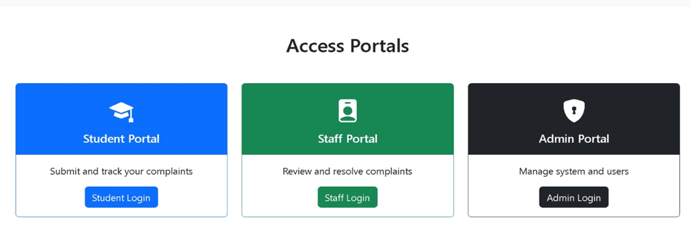

# SCMS – Student Complaint Management System

A web-based application to manage, track, and resolve student complaints efficiently.  
Designed to improve transparency, accountability, and response time between students and administrators.

---

## Features
- Student complaint submission with category and description
- Complaint tracking with status updates
- Admin dashboard for reviewing and resolving complaints
- Role-based access (Student / Admin)
- Secure authentication and authorization
- Centralized complaint history

---

## 📸 Application Screenshots

### System Portal

### Role Management

### Admin Dashboard

### Staff Dashboard

### Submit Complaint

## Tech Stack
- **Backend:** Django (Python)
- **Database:** SQLite
- **Frontend:** HTML, CSS, Bootstrap
- **Version Control:** Git
- **Platform:** GitHub

---
